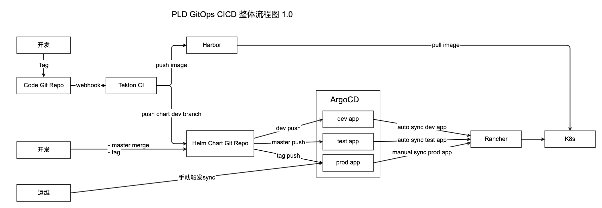

# 使用Tekton+Helm-Chart+ArgoCD构建GitOps CICD

## 整体流程图

## 编写helm chart

[快速编写通用helm-chart.md](./快速编写通用helm-chart.md)

## 使用Tekton实现CI流程

[使用Tekton构建CI流程](./使用Tekton构建CI流程.md)

## 使用ArgoCD实现CD流程

[helm安装argocd](./helm安装argocd.md)

[Argocd添加服务流程](./Argocd添加服务流程.md)