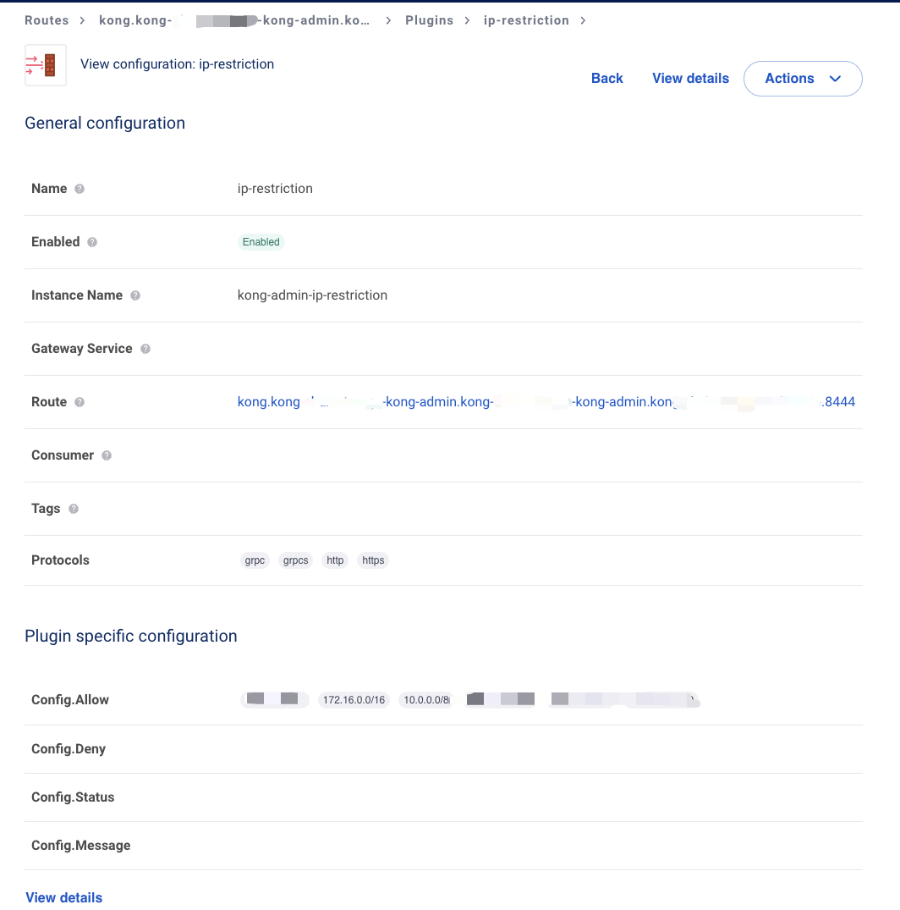
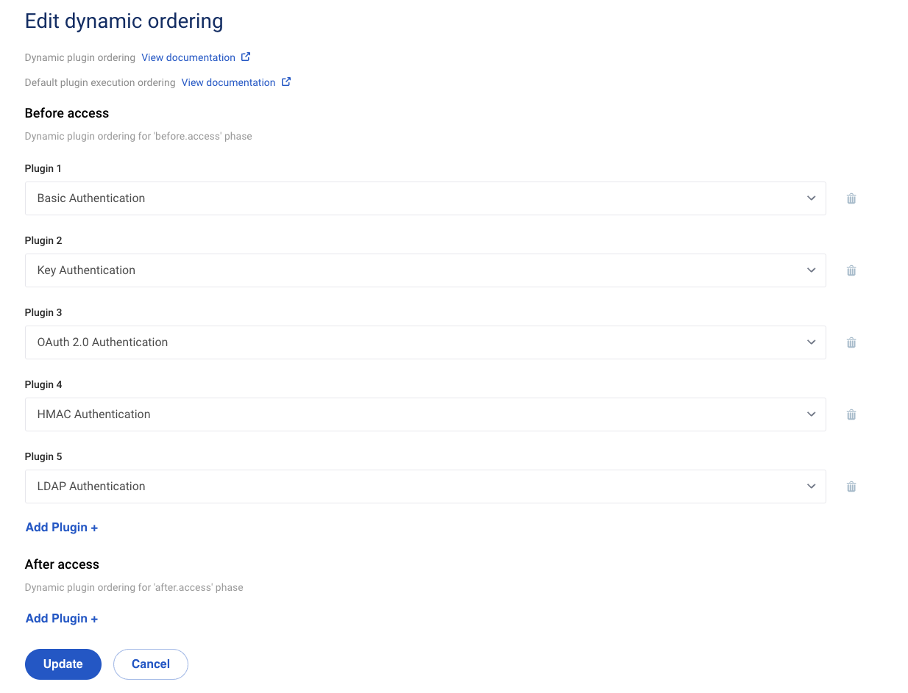

#  Kong使用ip-pestriction插件配置IP白名单

## 解决kong 代理发给plugin 的remote_addr不是真实IP, 为pod ip 问题

### 修改helm values.yaml

```yaml
...
proxy:
  annotations:
    prometheus.io/port: "9542"
    prometheus.io/scrape: "true"
  enabled: true
  http:
    containerPort: 8080
    enabled: true
    hostPort: 80
  ingress:
    enabled: false
  labels:
    enable-metrics: true
  tls:
    containerPort: 8443
    enabled: true
    hostPort: 443
  externalIPs:
    - 172.16.187.71
    - x.x.x.x
  externalTrafficPolicy: Local # 关键配置, Kong 代理默认情况下会将自己的 IP 地址作为 remote_addr 值发送给后端服务，配置此项会保留ClientIP, 不需要其它任何配置
  type: NodePort
 ...
```

### 更新 kong 服务

```sh
helm upgrade --install kong-chainstorage kong-2.20.2.tgz --namespace kong -f values.yam
```

## 配置ip-pestriction插件



### 手动配置插件在 Auth 相关插件前生效



## 相关调试命令

###  因插件配置问题屋kong admin 不能访问时，使用curl 调用 admin api 禁用 ip-restriction 插件

```sh
curl -k  -X PATCH https://10.108.62.202:8444/plugins/kong-admin-ip-restriction -d 'enabled=false
```

### 测试插件生效

```sh
curl  https://kong-admin.example.io/api

# 显示如下
{
  "message":"Your IP address is not allowed"
}%
```


## 参考

https://docs.konghq.com/kubernetes-ingress-controller/latest/guides/preserve-client-ip/

https://docs.konghq.com/gateway/latest/reference/configuration/#real_ip_header