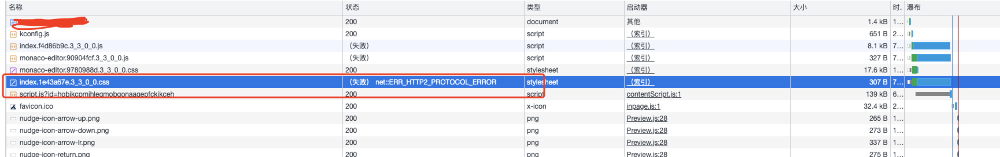

# kong manager页面显示空白，报错net:ERR_HTTP2_PROTOCOL_ERROR

## 故障描述

kong manager 页面打开后显示空白, 打开浏览器检查-网络查看加载url, 发现有三个资源加载异常, http code 200， 但是显示`net:ERR_HTTP2_PROTOCOL_ERROR`



## 故障排查

### 使用curl 访问失败资源

```sh
curl -v  https://kong.example.com/assets/monaco-editor.90904fcf.3_3_0_0.js
```

结果http code 200, 但是数据结果返回不完整，并且报错`curl: (92) HTTP/2 stream 1 was not closed cleanly: INTERNAL_ERROR (err 2)`，部分内容如下：

```
*   Trying x.x.x.x:443...
* Connected to kong.example.com (x.x.x.x) port 443 (#0)
* ALPN: offers h2,http/1.1
* (304) (OUT), TLS handshake, Client hello (1):
*  CAfile: /etc/ssl/cert.pem
*  CApath: none
* (304) (IN), TLS handshake, Server hello (2):
* (304) (IN), TLS handshake, Unknown (8):
* (304) (IN), TLS handshake, Certificate (11):
* (304) (IN), TLS handshake, CERT verify (15):
* (304) (IN), TLS handshake, Finished (20):
* (304) (OUT), TLS handshake, Finished (20):
* SSL connection using TLSv1.3 / AEAD-AES256-GCM-SHA384
* ALPN: server accepted h2
* Server certificate:
*  subject: CN=*.example.com
*  start date: Dec  6 00:00:00 2022 GMT
*  expire date: Dec 23 23:59:59 2023 GMT
*  subjectAltName: host "kong.example.com" matched cert's "*.example.com"
*  issuer: C=US; O=DigiCert, Inc.; CN=RapidSSL Global TLS RSA4096 SHA256 2022 CA1
*  SSL certificate verify ok.
* using HTTP/2
* h2h3 [:method: GET]
* h2h3 [:path: /assets/monaco-editor.90904fcf.3_3_0_0.js]
* h2h3 [:scheme: https]
* h2h3 [:authority: kong.example.com]
* h2h3 [user-agent: curl/7.88.1]
* h2h3 [accept: */*]
* Using Stream ID: 1 (easy handle 0x7f78ba80a800)
> GET /assets/monaco-editor.90904fcf.3_3_0_0.js HTTP/2
> Host: kong.example.com
> user-agent: curl/7.88.1
> accept: */*
>
< HTTP/2 200
< content-type: application/javascript; charset=UTF-8
< date: Thu, 27 Jul 2023 11:30:30 GMT
< expires: Wed, 25 Oct 2023 11:30:30 GMT
< cache-control: max-age=7776000
< cache-control: public
< x-frame-options: sameorigin
< x-xss-protection: 1; mode=block
< x-content-type-options: nosniff
< x-permitted-cross-domain-policies: master-only
< x-kong-upstream-latency: 7
< x-kong-proxy-latency: 0
< via: kong/3.3.1.0-enterprise-edition
...
ined,this._last=Dt.Undefined,this._size=0}unshift(e){return this._insert(e,!1)}push(e){return this._insert(e,!0)}_insert(e,t){const i=new Dt(e);if(this._first===Dt.Undefined)this._first=i,this._last=i;else if(t){const s=this._last;this._last=i,i.prev=s,s.next=i}else{const s=this._first;this._first=i,i.next=s,s.prev=i}this._size+=1;let n=!1;return()=>{n||(n=!0,this._remove(i))}}shift(){if(this._first!==Dt.Undefined){const e=this._first.element;return this._remove(this._first),e}}pop(){if(this._last!==Dt.Undefined){const e=this._last.element;return thi* HTTP/2 stream 1 was not closed cleanly: INTERNAL_ERROR (err 2)
* Connection #0 to host kong.example.com left intact
curl: (92) HTTP/2 stream 1 was not closed cleanly: INTERNAL_ERROR (err 2)
s._remove(this._last),e}}_remove(e){if(e.prev!==Dt.Undefined&&e.next!==Dt.Undefined){const t=e.prev;t.next=e.next,e.next.prev=t}else e.prev===Dt.Undefined&&e.next===Dt.Undefined?(this._first=Dt.Undefined,this._last=Dt.Undefined):e.next===Dt.Undefined?(this._last=this._last.prev,this._last.next=Dt.Undefined):e.prev===Dt.Undefined&&(this._first=this._first.next,this._first.prev=Dt.Undefined);this._size-=1}*[Symbol.iterator](){let e=this._first;for(;e!==Dt.Undefined;)yield e.element,e=e.next}toArray(){const e=[];for(let t=this._first;t!==Dt.Undefined;t=t.next)e.push(t.element);return e}}var se;(function(o){o.None=()=>B.None;function e(C){return(w,L=null,D)=>{let S=!1,E;return E=C(I=>{if(!S)return E?E.dispose():S=!0,w.call(L,I)},null,D),S&&E.dispose(),E}}o.once=e;function t(C,w){return l((L,D=null,S)=>C(E=>L.call(D,w(E)),null,S))}o.map=t;function i(C,w){return l((L,D=null,S)=>C(E=>{w(E),L.call(D,E)},null,S))}o.forEach=i;function n(C,w){return l((L,D=null,S)=>C(E=>w(E)&&L.call(D,E),null,S))}o.filter=n;function s(C){return C}o.signal=s;function r(...C){return(w,L=null,D)=>ds(...C.map(S=>S(E=>w.call(L,E),null,D)))}o.any=r;functio%
```

### 登录相同网关但非k8s集群内主机 curl 测试

```sh
curl -v  https://kong.example.com/assets/monaco-editor.90904fcf.3_3_0_0.js
```

结果也是数据加载不完整，但是报错与直接外网访问有些不同，错误信息为`curl: (18) transfer closed with outstanding read data remaining`, 部分内容如下:

```
...
{constructor(){const e=[],t={type:"number",description:m("rulers.size","Number of monospace characters at which this editor ruler will render.")};super(83,"rulers",e,{type:"array",items:{anyOf:[t,{type:["object"],properties:{column:t,color:{type:"string",description:m("rulers.color","Color of this editor ruler."),format:"color-hex"}}}]},default:e,description:m("rulers","Render vertical rulers after a certain number of monospac* transfer closed with outstanding read data remaining
* Closing connection 0
curl: (18) transfer closed with outstanding read data remaining
e characters. Use multiple values for multiple rulers. No rulers are drawn if array is empty.")})}validate(e){if(Array.isArray(e)){let t=[];for(let i of e)if(typeof i=="number")t.push({column:ct.clampedInt(i,0,0,1e4),color:null});else if(i&&typeof i=="object"){const n=i;t.push({column:ct.clampedInt(n.column,0,0,1e4),color:n.color})}return t.sort((i,n)=>i.column-n.column),t}return this.defaultValue}}function wL(o,e){if(typeof o!="string")return e;switch(o){case"hidden":return 2;case"visible":return 3
```

### 查看kong服务日志

```sh
kubectl logs test-kong-f9cc74965-g5cxc -n kong -c proxy --tail 1000
```

发现如下异常日志

```

2023/07/27 11:28:56 [crit] 2379#0: *22526 mkdir() "/kong_prefix/proxy_temp/6" failed (13: Permission denied) while reading upstream, client: 172.17.43.158, server: kong, request: "GET /assets/monaco-editor.90904fcf.3_3_0_0.js HTTP/1.1", upstream: "https://10.128.3.208:8445/assets/monaco-editor.90904fcf.3_3_0_0.js", host: "kong.example.com"
```

原来是 访问 失败的js 使用http2 协议时会缓存数据到 `/kong_proxy/proxy_temp/6` 提示没有限制而失败

### 进制kong 服务pod debug

```sh
kubectl exec -it test-kong-f9cc74965-g5cxc -n kong -c proxy sh
```

```sh
 ls -l kong_prefix/ -l
```

```

total 32
drwx------    2 kong     nogroup          6 Jul 28 06:59 client_body_temp
drwx------    2 kong     nogroup          6 Jul 28 06:59 fastcgi_temp
lrwxrwxrwx    1 kong     nogroup         19 Jul 28 06:59 gui -> /usr/local/kong/gui
drwxr-xr-x    2 kong     nogroup         24 Jul 28 06:59 gui_config
drwxr-xr-x    2 kong     nogroup        179 Jul 28 06:59 logs
-rw-r--r--    1 kong     nogroup       2626 Jul 28 06:59 nginx-kong-gui-include.conf
-rw-r--r--    1 kong     nogroup       4742 Jul 28 06:59 nginx-kong-stream.conf
-rw-r--r--    1 kong     nogroup      15418 Jul 28 06:59 nginx-kong.conf
-rw-r--r--    1 kong     nogroup        406 Jul 28 06:59 nginx.conf
drwxr-xr-x    2 kong     nogroup         23 Jul 28 06:59 pids
drwxr-xr-x    2 kong     nogroup          6 Jul 28 06:59 profiling
drwx------    2 root     root          6 Jul 28 06:59 proxy_temp
drwx------    2 kong     nogroup          6 Jul 28 06:59 scgi_temp
drwxr-xr-x    2 kong     nogroup         27 Jul 28 06:59 ssl
srw-rw-rw-    1 kong     nogroup          0 Jul 28 06:59 stream_rpc.sock
srw-rw-rw-    1 kong     nogroup          0 Jul 28 06:59 stream_tls_passthrough.sock
srw-rw-rw-    1 kong     nogroup          0 Jul 28 06:59 stream_tls_terminate.sock
srw-rw-rw-    1 kong     nogroup          0 Jul 28 06:59 stream_worker_events.sock
drwx------    2 kong     nogroup          6 Jul 28 06:59 uwsgi_temp
srw-rw-rw-    1 kong     nogroup          0 Jul 28 06:59 worker_events.sock
```

发现 `proxy_temp` 目录为root owner, 这个是因为最近修改error_template_html 挂载到这个目录，导致这个目录owner 变为root

## 解决问题

修改helm values 中 error template html 相关配置内容，修改挂载目录到一个新目录，不影响原有proxy_temp 目录

```yaml
env:
  ...
  error_template_html: "/kong_prefix/error_template/error_template.html"
...
extraConfigMaps:
  - name: error-template-html
    mountPath: /kong_prefix/error_template
```

更新helm chart

```sj
helm upgrade --install test kong-2.25.0.tgz --namespace kong -f values.yaml
```

等Kong 服务正常更新启动后，再访问kong manager 页面后正常

## 参考

https://developer.aliyun.com/article/975820