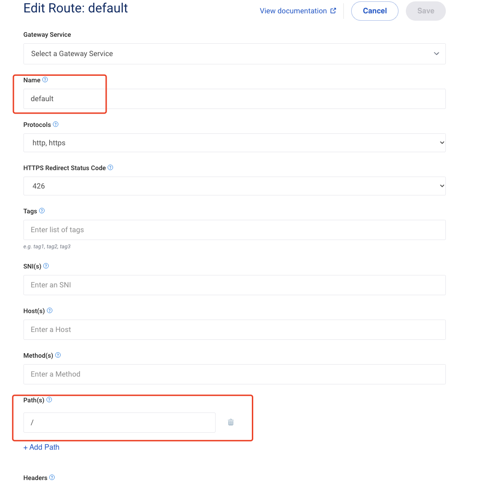
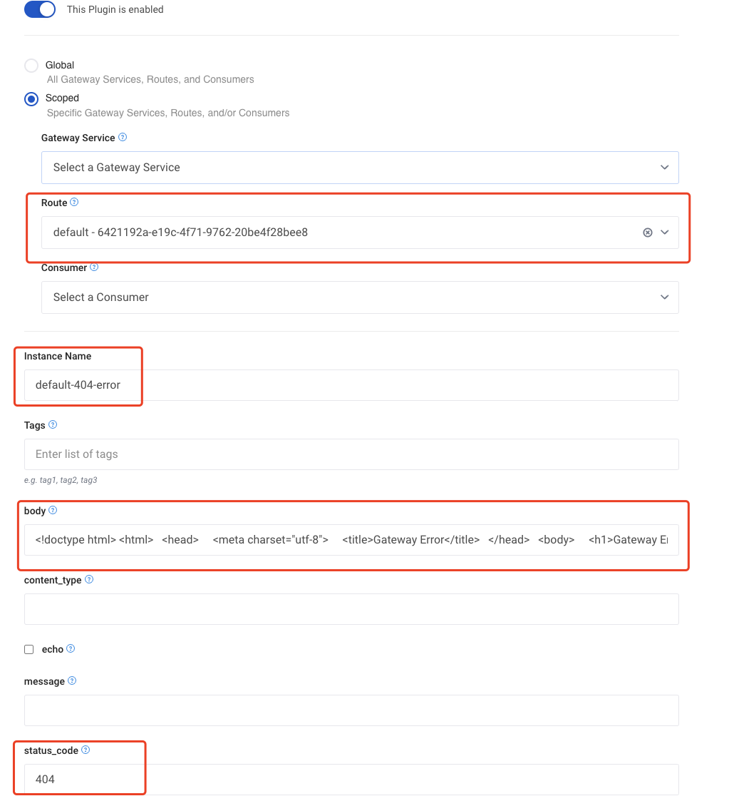

# kong 自定义默认error html

##  方式一：添加默认路由并绑定request-termination 插件替换默认html

**这种方式适用单个路由的单个http code替换错误页面**



### 默认路由添加 request-termination 插件

**注意：同一个路由 同一个插件只能添加一次，下面的示例只能替换404 error 的页面**



## 方式二：添加 error-template-html 扩展 configmap替换默认的error template

方式一的方法只能替换其中一个http code 的错误html, 不能解决其它code 问题，方式二挂载扩展configmap + 配置 error_template_html 的方式替换通用的 error template

**这种方式适用替换默认的通用error template  html **

### 创建error_template.html

```html
<!doctype html>
<html>
  <head>
    <meta charset="utf-8">
    <title>Gateway Error</title>
  </head>
  <body>
    <h1>Gateway Error</h1>
    <p>%s.</p>
  </body>
</html>
```

### 创建 configmap error-template-html

```sh
kubectl create configmap error-template-html --from-file=error_template.html -n kong
```

###  helm values 添加 error_template_html 配置

```yaml
env:
  ...
  error_template_html: "/kong_prefix/error_template/error_template.html"
...
extraConfigMaps:
  - name: error-template-html
    mountPath: /kong_prefix/error_template
```

### 更新helm

```sh
helm upgrade --install test kong-2.20.2.tgz --namespace kong -f values.yaml
```

## 参考

https://support.konghq.com/support/s/article/How-to-create-a-catch-all-route-for-unmatched-paths?_ga=2.1458740.444088506.1690183560-1640846521.1683802307

https://docs.konghq.com/gateway/latest/reference/configuration/

https://docs.konghq.com/gateway/3.3.x/production/kong-conf/

https://github.com/Kong/kong/blob/master/kong/tools/utils.lua