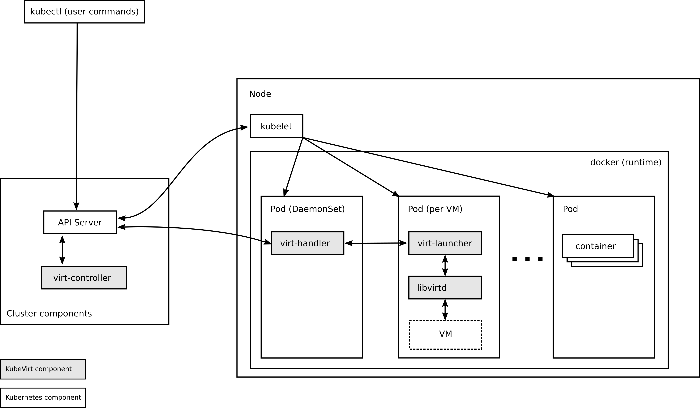

# Kubevirt on Openshift 

## Kubevirt 架构 

参考：

[https://github.com/kubevirt/kubevirt/blob/master/docs/architecture.md](https://github.com/kubevirt/kubevirt/blob/master/docs/architecture.md)
[https://github.com/kubevirt/kubevirt/blob/master/docs/components.md](https://github.com/kubevirt/kubevirt/blob/master/docs/components.md)


KubeVirt使用面向服务的体系结构和编排模式构建。

### KubeVirt包含的一系列服务

```
            |
    Cluster | (virt-controller)
            |
------------+---------------------------------------
            |
 Kubernetes | (VMI CRD)
            |
------------+---------------------------------------
            |
  DaemonSet | (virt-handler) (vm-pod M)
            |

M: Managed by KubeVirt
CRD: Custom Resource Definition
```

kubevirt支持docker 及 crio 两种容器运行时

需要虚拟化服务的用户与虚拟化 API通信，后者又与Kubernetes集群通信以安排所请求的虚拟机实例（VMI），调度，网络和存储都委托给Kubernetes，而KubeVirt则提供虚拟化功能。

### 应用布局

* Cluster
	* KubeVirt 组件
	    * virt-controller
	    * virt-handler
	    * libvirtd
	    * …
	* KubeVirt 管理 Pods
	    * VMI Foo
	    * VMI Bar
	    * …
	    
### 架构图



### 示例流程：创建和删除VMI

下面的流程演示了KubeVirt中存在的几个(不是所有)组件之间的通信流。通常，可以将通信模式看作是编排，其中所有组件都自己执行操作，以实现VMI对象提供的状态。

```
Client                     K8s API     VMI CRD  Virt Controller         VMI Handler
-------------------------- ----------- ------- ----------------------- ----------

                           listen <----------- WATCH /virtualmachines
                           listen <----------------------------------- WATCH /virtualmachines
                                                  |                       |
POST /virtualmachines ---> validate               |                       |
                           create ---> VMI ---> observe --------------> observe
                             |          |         v                       v
                           validate <--------- POST /pods              defineVMI
                           create       |         |                       |
                             |          |         |                       |
                           schedPod ---------> observe                    |
                             |          |         v                       |
                           validate <--------- PUT /virtualmachines       |
                           update ---> VMI ---------------------------> observe
                             |          |         |                    launchVMI
                             |          |         |                       |
                             :          :         :                       :
                             |          |         |                       |
DELETE /virtualmachines -> validate     |         |                       |
                           delete ----> * ---------------------------> observe
                             |                    |                    shutdownVMI
                             |                    |                       |
                             :                    :                       :
```

免责声明：上图不完全准确，因为有一些临时的解决方法可以避免bugs和解决一些其他问题。

1. 客户端将新的VMI定义发布到K8s API服务器。
2. K8s API服务器验证输入并创建VMI自定义资源定义（CRD）对象。
3. virt-controller观察新VMI对象的创建并创建一个相应的pod。
4. Kubernetes正在主机上安排pod。
5. virt-controller观察到VMI的pod已启动并更新了VMI对象中的nodeName字段。现在已经设置了nodeName，责任转移到virt-handler以进行下一步的操作。
6. virt-handler（DaemonSet）观察到VMI已分配了运行它的主机。
7. virt-handler使用VMI规范，并在VMI的pod中使用libvirtd实例发出创建相应域的信号。
8. 客户端通过virt-api-server删除VMI对象。
9. virt-handler观察删除并关闭域。

## 安装openshift 使用 crio(with runv)

参考：
https://docs.openshift.com/container-platform/3.11/cnv_install/cnv_install.html#cnv_introduction_to_cnv-cnv-install

主要的修改内容为

```
[OSEv3:children]
masters
nodes
etcd

[OSEv3:vars]
# Enable admission controller webhooks
openshift_master_admission_plugin_config={"ValidatingAdmissionWebhook":{"configuration":{"kind": "DefaultAdmissionConfig","apiVersion": "v1","disable": false}},"MutatingAdmissionWebhook":{"configuration":{"kind": "DefaultAdmissionConfig","apiVersion": "v1","disable": false}}}

# CRI-O
openshift_use_crio=true

[nodes]
master.example.com openshift_node_group_name='node-config-master-crio'
infra.example.com openshift_node_group_name='node-config-infra-crio'
node1.example.com openshift_node_group_name='node-config-compute-crio'
```

需要修改的内容，已经在offline安装包（openshift官方为基础自研）中添加到下面模板文件中

`ansible.hosts.virt.crio.tpl`

安装 `offline-openshift-origin.3.11` 时使用即可

## 如果 openshift 使用 docker（默认建议）

参考：
https://docs.openshift.com/container-platform/3.11/cnv_install/cnv_install.html#cnv_introduction_to_cnv-cnv-install

主要的修改内容为

```
[OSEv3:vars]
# Enable admission controller webhooks
openshift_master_admission_plugin_config={"ValidatingAdmissionWebhook":{"configuration":{"kind": "DefaultAdmissionConfig","apiVersion": "v1","disable": false}},"MutatingAdmissionWebhook":{"configuration":{"kind": "DefaultAdmissionConfig","apiVersion": "v1","disable": false}}}
```

需要修改的内容，已经在offline安装包（openshift官方为基础自研）中添加到下面模板文件中

`ansible.hosts.virt.tpl`

安装 `offline-openshift-origin.3.11` 时使用即可

容器运行时使用docker时 需要关闭 节点selinux(启用sriov网络需要)

```
ansible nodes -m shell -a "setenforce 0 && sed -i 's/SELINUX=.*/SELINUX=permissive/g' /etc/selinux/config"
```

## 安装kubevirt

### 检查webhook配置

登录master主机

检查现有openshift集群master配置文件是否配置了MutatingAdmissionWebhook和ValidatingAdmissionWebhook，如果没有，在master主机修改`/etc/origin/master/master-config.yaml`

在下面位置添加相关配置

```
admissionConfig:
  pluginConfig:
    ...
    MutatingAdmissionWebhook:
      configuration:
        apiVersion: v1
        disable: true
        kind: DefaultAdmissionConfig
    ValidatingAdmissionWebhook:
      configuration:
        apiVersion: v1
        disable: false
        kind: DefaultAdmissionConfig
    ...
```

重启master api 和 controllers

```
master-restart api
master-restart controllers
```

### 部署kubevirt

登录安装机

安装oc客户端

```
yum install -y origin-clients
```

clone kubevirt代码

```
git clone https://github.com/paradeum-team/kubevirt-ansible.git
```

登录管理员

```
oc login -u <admin_user> -p <admin_password> master164-53.hisun.com:8443
```

给ui使用sa 添加管理员权限

```
oc adm policy add-cluster-role-to-user  cluster-admin system:serviceaccount:kubevirt-web-ui:kubevirt-web-ui-operator
```

vi roles/kubevirt/templates/kubevirt-config.yaml

添加 `debug.useEmulation: 'true'`， 使用完全虚拟化

内容如下：

```
apiVersion: v1
kind: ConfigMap
metadata:
  name: kubevirt-config
  labels:
    kubevirt.io: ""
data:
  feature-gates: "DataVolumes,SRIOV,LiveMigration,CPUManager"
  debug.useEmulation: 'true'
```

修改变量

vi vars/all.yml

```
...
### KubeVirt ###
version: 0.19.0
...
### Web UI ##
...
kubevirt_web_ui_version: "v2.0.0-14.8"
...
```

安装kubevirt

```
ansible-playbook -i localhost playbooks/kubevirt.yml -e@vars/all.yml -e debug_use_emulation=true
```

## 下载virtctl

```
curl -L -o /usr/bin/virtctl https://github.com/kubevirt/kubevirt/releases/download/v0.19.0/virtctl-v0.19.0-linux-amd64
chmod +x /usr/bin/virtctl 
```

## 制作kubevirt 使用的 vmdisks


### 下载，并解压centos7.6.1811 云通用镜像

```
# curl -O https://cloud.centos.org/centos/7/images/CentOS-7-x86_64-GenericCloud-1811.qcow2.xz

# xz -d CentOS-7-x86_64-GenericCloud-1811.qcow2.xz
```

### 制作vm containerDisk 镜像

在kubevirt 0.20之前，containerDisk映像需要将 kubevirt/container-disk-v1alpha 作为基本映像。

```
cat << END > Dockerfile
FROM  kubevirt/container-disk-v1alpha:v0.19.0
ADD CentOS-7-x86_64-GenericCloud-1905.qcow2 /disk
END

docker build -t offlineregistry.dataman-inc.com:5000/vmdisks/centos7:1905 .
docker push offlineregistry.dataman-inc.com:5000/vmdisks/centos7:1905
```

## 发布 centos7 vm

访问 https://kubevirt-web-ui.apps164-53.hisun.com

使用yaml发布vm

```
apiVersion: kubevirt.io/v1alpha3
kind: VirtualMachine
metadata:
  name: centos7-1905
spec:
  running: true
  template:
    metadata:
      labels:
        vm.kubevirt.io/name: centos7-1905
    spec:
      domain:
        cpu:
          cores: 1
        devices:
          disks:
            - disk:
                bus: virtio
              name: rootdisk
            - disk:
                bus: virtio
              name: cloudinitdisk
          interfaces:
            - bridge: {}
              name: default
        resources:
          requests:
            memory: 500M
      networks:
        - name: default
          pod: {}
      hostname: centos7-1905
      terminationGracePeriodSeconds: 5
      volumes:
        - containerDisk:
            image: 'offlineregistry.dataman-inc.com:5000/vmdisks/centos7:1905'
          name: rootdisk
        - cloudInitNoCloud:
            userData: |
              #cloud-config
              ssh_pwauth: yes
              chpasswd:
                list: |
                    root:123456
                    centos:123456
                expire: false
          name: cloudinitdisk
```

创建service, 暴露vm 内端口

```
virtctl expose vm centos7-1905 --name vmiservice-centos7 --port 8100 --target-port 8100
```

## 卸载kubevirt

卸载kubevirt

```
ansible-playbook -i localhost playbooks/kubevirt.yml -e@vars/all.yml -e apb_action=deprovision
```

## 附录

kubevirt 操作 API地址  

[https://kubevirt.io/api-reference/v0.19.0/operations.html](https://kubevirt.io/api-reference/v0.19.0/operations.html)