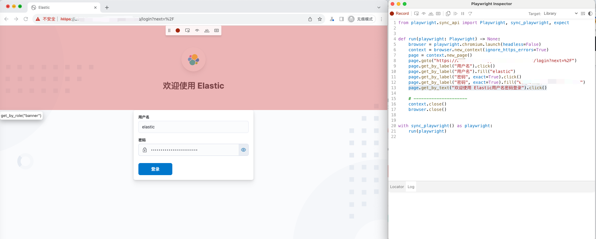

#  使用playwright截图Kibana图表

## 安装 playwright

```sh
pip install playwright
```

## 安装 playwright 依赖项

```sh
playwright install --with-deps
```

## 使用playwright自动生成代码

使用`playwright` 生成访问`kibana dashboard` 代码，其中`--ignore-https-errors`为忽略证书认证

```sh
playwright codegen --ignore-https-errors "https://kibana.liujinye.example/"
```

上面命令执行完会自动调用 chromium ，并生成python 代码，如图：



自动生成代码示例如下：

```python
from playwright.sync_api import Playwright, sync_playwright, expect


def run(playwright: Playwright) -> None:
    browser = playwright.chromium.launch(headless=False)
    context = browser.new_context(ignore_https_errors=True)
    page = context.new_page()
    page.goto("https://kibana.liujinye.example/login?next=%2F")
    page.get_by_label("用户名").click()
    page.get_by_label("用户名").fill("elastic")
    page.get_by_label("密码", exact=True).click()
    page.get_by_label("密码", exact=True).fill("xxxxxxxxxxxxxxx")
    page.get_by_text("欢迎使用 Elastic用户名密码登录").click()

    # ---------------------
    context.close()
    browser.close()


with sync_playwright() as playwright:
    run(playwright)

```

在生成好的代码基础上增加一些其它逻辑

```python
from playwright.sync_api import Playwright, sync_playwright


def run(playwright: Playwright) -> None:
    browser = playwright.chromium.launch(
        headless=False, # 本地调度不使用headless 自动打开浏览器界面,服务器设置为True 
        args=['--start-maximized']
    )
    # 增加设置窗口大小
    context = browser.new_context(ignore_https_errors=True,viewport={'width': 1792, 'height': 1120})
    page = context.new_page()
    page.goto("https://kibana.liujinye.example/")
    page.get_by_label("用户名").fill("elastic")
    page.get_by_label("密码", exact=True).fill("xxxxxxxxxxxx")
    page.get_by_role("button", name="登录").click()
    # 增加等待页面加载超时时间
    page.wait_for_timeout(5000)

	  # 在浏览器中输入要请求的dashboard
    page.goto("https://kibana.liujinye.example/app/dashboards#/view/c95bd6e0-7a22-11ee-8b13-0f9a027c16f6?_g=(refreshInterval%3A(pause%3A!t%2Cvalue%3A60000)%2Ctime%3A(from%3Anow-7d%2Fd%2Cto%3Anow))")
    # 增加等待页面加载超时时间
    page.wait_for_timeout(10000)
    # 添加的截图代码
    page.screenshot(path=f'example.png', full_page=True)

    context.close()
    browser.close()


with sync_playwright() as playwright:
    run(playwright)

```

## Dockerfile示例

```dockerfile
FROM python:3.11-slim-bookworm

WORKDIR /home/app/

COPY requirements.txt   .

RUN mkdir -p /home/app/python

ENV PATH=$PATH:/home/app/.local/bin:/home/app/python/bin/
ENV PYTHONPATH=$PYTHONPATH:/home/app/python
ENV PYTHONUNBUFFERED=1
ENV PLAYWRIGHT_HEADLESS=True

RUN  pip install -r requirements.txt --target=/home/app/python \
     && playwright install chromium --with-deps

COPY main.py		.
ENTRYPOINT ["python"]
CMD ["main.py"]
```

## 参考

https://playwright.dev/docs/api/class-page#page-goto

https://developer.aliyun.com/article/835305