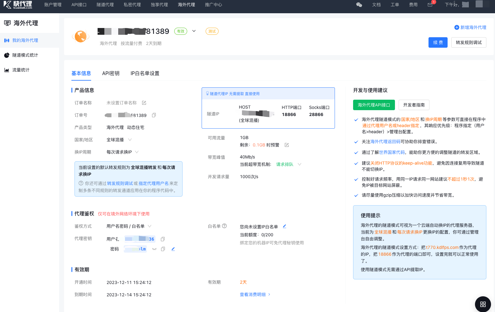

# 使用快代理使用海外代理访问海外网站

## 注册快代理

略

## 创建海外代理订单

**注意：海外代理只能在大陆以外的主机访问使用**

点免费试用 --> 选择海外代理 --> 创建海外代理

## 查看海外代理

https://www.kuaidaili.com/uc/fps/



## 使用golang 访问代理服务

参考：https://www.kuaidaili.com/doc/dev/sdk_tps_http/#_1

使用提示

1. http和https网页均可适用
2. 建议*关闭HTTP协议的keep-alive功能*，避免因连接复用导致隧道不能切换IP。

示例代码

```go
// 请求隧道服务器
// http和https网页均适用

package main

import (
	"compress/gzip"
	"fmt"
	"io"
	"net/http"
	"net/url"
	"os"
)

func main() {
	// 用户名密码, 若已添加白名单则不需要添加
	username := "username" // 上一步图中的代理鉴权用户名
	password := "password" // 上一步图中的代理鉴权密码

	// 隧道服务器
  proxy_raw := "xxx.xxx.com:18866" // 上一步图中的隧道IP HOST地址:http端口或socks端口
	proxy_str := fmt.Sprintf("http://%s:%s@%s", username, password, proxy_raw)
	proxy, err := url.Parse(proxy_str)

	// 目标网页
	page_url := "http://dev.kdlapi.com/testproxy"

	//  请求目标网页
	client := &http.Client{Transport: &http.Transport{Proxy: http.ProxyURL(proxy)}}
	req, _ := http.NewRequest("GET", page_url, nil)
	req.Header.Add("Accept-Encoding", "gzip") //使用gzip压缩传输数据让访问更快
	res, err := client.Do(req)

	if err != nil {
		// 请求发生异常
		fmt.Println(err.Error())
	} else {
		defer res.Body.Close() //保证最后关闭Body

		fmt.Println("status code:", res.StatusCode) // 获取状态码

		// 有gzip压缩时,需要解压缩读取返回内容
		if res.Header.Get("Content-Encoding") == "gzip" {
			reader, _ := gzip.NewReader(res.Body) // gzip解压缩
			defer reader.Close()
			io.Copy(os.Stdout, reader)
			os.Exit(0) // 正常退出
		}

		// 无gzip压缩, 读取返回内容
		body, _ := io.ReadAll(res.Body)
		fmt.Println(string(body))
	}
}

```

**注意：海外代理只能在大陆以外的主机访问使用,所以测试程序部署使用其它代理或部署在大陆以外服务器**

运行后显示结果如下：

```
status code: 200
sucess! client ip: x.x.x.x 
```

