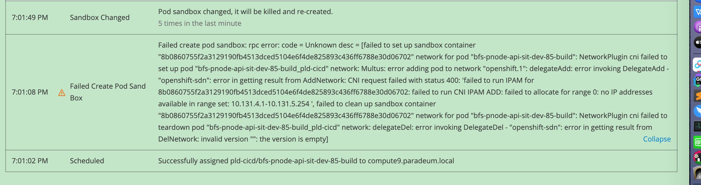

# pod pending event报错cni无可用IP

如图报错



解决方法参考：

https://access.redhat.com/solutions/4457521

https://github.com/debianmaster/openshift-examples/issues/59


按下面步骤操作

```
oc adm drain <node> --delete-local-data --ignore-daemonsets
rm -rf /var/lib/cni/networks/openshift-sdn/*
oc adm uncordon <node>
```

注意：因为Pod异常状态时间比较长，自动恢复比较慢，可手动异常pod快速恢复，特殊情况也可以手动重启docker