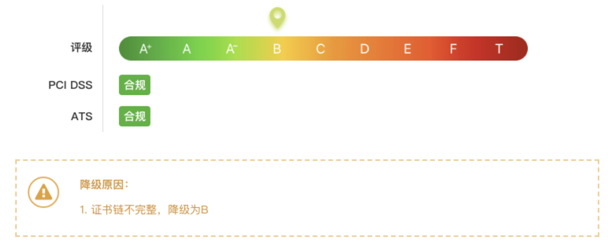
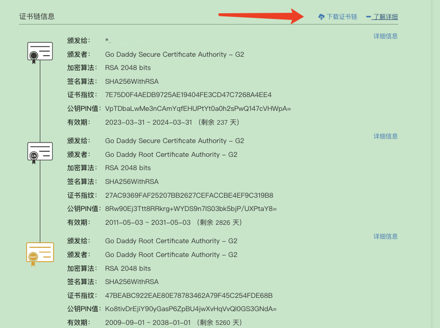

# 证书未过期但是报NET::ERR_CERT_AUTHORITY_INVALID证书错误处理

## 检查证书

Chrome -> 右键 -> 检查 -> 安全 -> 查看证书



发现证书未过期

## 使用在线工具检查

访问 `https://myssl.com/ssl.html`

输入 检查的网站域名`example.com`

如类似如下结果，示例为正常显示，异常情况评级是 A 以下


提示证书链不完整，原因是浏览器或服务器默认会集成一些CA证书，但是有些厂商的CA证书在浏览器或服务器中没有，就会出现证书不可信问题，即使你的证书确实是可信的，但依旧会显示成不可信，只有等到浏览器自动把缺失的那张`CA`证书从网上下载下来之后(某些时候因为CA源的网站访问不到，会导致网站显示不可信)，访问该网站才会显示成可信状态。

解决方法：在部署证书的时候，把那张缺失的`CA`证书一并部署。目前一般的证书签发机构在签发证书的时候会把该`CA`证书一并打包。但如果确实缺失了这张`CA`证书也不要慌，`MySSL`能够帮你补全证书链。

## 使用myssl.com 下载证书链

在上面检测结果的下方有证书链信息，可以直接下载



也可以单独访问证书链下载、修复地址 获取证书链 https://myssl.com/chain_download.html

## 更新证书

在k8s中使用下载的证书链替换原来的 example.com.crt 证书

```sh
kubectl create secret tls example-com-tls --cert=example.com.crt --key=example.com.key -n example-namespace --dry-run=client -o yaml|kubectl apply -f -
```


## 参考

https://blog.myssl.com/faq-miss-ca-certificate/

https://myssl.com/example.com?domain=example.com&port=443

https://blog.myssl.com/faq-miss-ca-certificate/